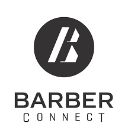

# Projeto Integrador
#### Por: Fabiano Taguchi
__________________________

# BarbeariaOnline

**1. Nome da solução**
BarberConnect

**2. Logotipo da solução**

   
**3. Cenário**
As barbearias tradicionais estão enfrentando o desafio de se adaptarem ao ambiente online devido à crescente demanda por serviços de barbearia acessíveis e convenientes. Os clientes buscam agendar seus cortes de cabelo e cuidados pessoais de forma rápida e eficiente, sem a necessidade de visitas presenciais ou ligações telefônicas.

**4. Requisitos a serem atendidos:**
* Requisitos funcionais *

  Cadastro de Cliente,
  Login de Cliente,
  Visualização de Horarios Disponivel,
  Agendamento de Horarios,
  confirmação por E-mail,
  Cancelamento de Agendamento,
  Gerenciamento de Calendario,
  Pagamento Online.
  
* Requisitos não funcionais

  Desempenho,
  Segurança,
  Usabilidade.
  
**5. Tecnologias utilizadas**

**6. Cronograma para desenvolvimento**

## Sobre a solução
**1. Pré-requisitos para instalação da solução**

**2. Instalação do projeto**

**3. Credenciais para teste**

**4. Informações sobre o colaborador**
